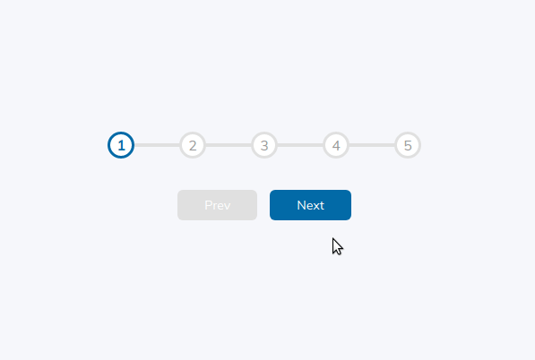

# Progress Steps

Project 2 of 50 from Brad Traversy's "50 Projects in 50 Days" course on Udemy.

Interact with the project yourself by [viewing the live demonstration online!](https://mdillemuth.github.io/progress-steps/)

## Demo

## Description

This is a simple component that dynamically displays a progress bar with various checkpoints along the way.

This is a common design pattern that can be observed on a variety of web applications. An example might be signing up for car insurance online or completing the checkout process on an e-commerce platform.

A simple way to improve your user's experience (UX) is to keep them engaged with how close they are to being finished with what they are doing. It is not uncommon for a user to abandon a shopping cart or a lengthy application when it feels like it's going to take forever.

## Technology

- HTML
  - Semantic HTML5
  - Accessibilty compliant
- CSS
  - Flexbox
  - Media Queries
- JavaScript
  - ES6 Syntax

## Modifications from the Original

- Add CSS rules to change UI color when all tasks are completed
- Darken color to meet Lighthouse Accessibility checker for contrast
- Implement semantic HTML tags

## Credit

This is project #2 of 50 from Brad Traversy's [50 Projects in 50 Days: HTML, CSS, & JavaScript](https://www.udemy.com/course/50-projects-50-days/)
